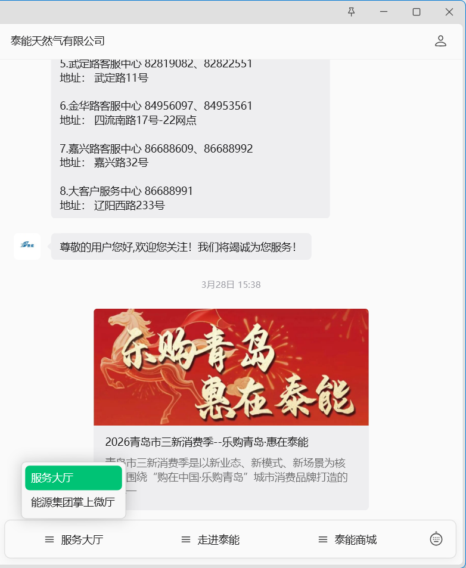
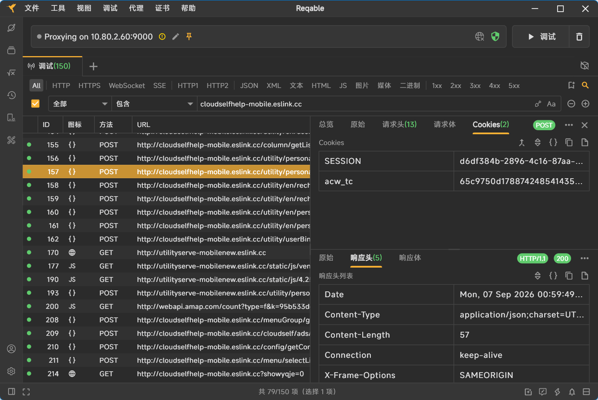

# 青岛泰能燃气 · Home Assistant 集成


从微信公众号「泰能天然气有限公司」背后的 **ESLink 易联云** 平台读取燃气数据，
在 Home Assistant 中按**计费账期**展示用气累计、官方抄表读数与**逐日耗气量**，
并提供**当年累计用量**与**燃气费单价**，帮你实时核算泰能燃气的**阶梯计费**。


> 参考项目：[sunfang1cn/hass-hangzhou-ranqi](https://github.com/sunfang1cn/hass-hangzhou-ranqi)（杭州燃气）
> 本集成沿用其架构，接口与鉴权方式针对青岛泰能（ESLink）重新适配。

---

## ⚠️ 使用前必读

1. **必须抓包获取 SESSION**
   微信 OAuth 的 `code` 只能由微信客户端产生，服务端无法自动登录。
   因此本集成**不做自动登录**，需你手动抓一次包拿到 `SESSION` Cookie 填入。

2. **只能在家庭宽带 / HA 局域网内运行**
   该平台网关按出口 IP 拦截。实测云服务器、公司网络、代理环境一律返回
   `403 policy_default_denied`，**与代码无关**。

3. **SESSION 会过期（周期未实测）**
   过期后 HA 会弹出「重新认证」，在集成选项里更新即可，**无需删除重建**。

---

## 功能

| 传感器 | 说明 | 类型 |
|---|---|---|
| `上个账期累计表读数` | 官方抄表读数（每月末抄表结算时才更新） | `total_increasing` |
| `本账期累计用量` | 自官方抄表日之后逐日结算的用量合计（账期非自然月） | `total`（账期起算日重置） |
| `最近一日用量` | 最后一个**已结算日**的用气量 | `total` |
| `每日耗气量 YYYY-MM-DD` | 每个**已结算日**一个实体，值固定；新的一天结算后自动补录 | 无 `state_class`（固定快照，仅展示） |
| `燃气总用量` | = 上个账期累计表读数 + 本账期累计用量（燃气表当前累计读数） | `total_increasing`（可直接接入能源面板） |
| `当年累计用量` | 户·年累计（每年 1 月 1 日清零），用于核算阶梯计费 | `total`（每年 1 月 1 日重置） |
| `燃气费单价` | 按当年累计用量判定的**当前边际单价**（3.54 / 4.12 / 4.99 元/m³） | `measurement` |

- **计费周期非自然月**：泰能每月在月末抄表结算（如 2026-08-30 抄表、读数 207.0），
  账单按「抄表日 → 下一抄表日」计费（例如 07-31 ~ 08-30 的 8.0 m³ 与自然月 8 月的
  8.1 m³ 并不相等），因此用「账期」口径命名传感器
- 实时连续估算值以「预计当前读数」属性形式附在 `上个账期累计表读数` 上，
  供能源面板等模板使用（见下方属性）
- **每日查询计划可配置**（v1.2.2）：每天查询次数 1–4 次 + 基础查询时间，
  其余时刻按 24 小时均分自动推导（燃气数据每日才变，分钟级轮询会触发风控）
- 每次查询都会写入 HA 日志（时间、当日第几次、成功/失败、下次查询时间）
- 全 `async` 实现，不阻塞 HA 事件循环
- 更新失败时**保留上次的值**，不会让图表出现断线
- Options Flow：不改配置就能更新 SESSION、切换校准开关、调整每日查询计划

### 每日查询计划（v1.2.2）

在 **集成选项** 中可配置：

| 选项 | 范围/示例 | 说明 |
|---|---|---|
| `每天查询次数` | 1 – 4 | 一天内的自动查询总次数（默认 4） |
| `基础查询时间` | `HH:MM`（默认 `06:00`） | 作为对齐基准，其余时刻自动推导 |

推导规则：把 24 小时按次数**均分**（间隔 = 24h ÷ 次数），以基础查询时间为基准依次排布。
例如：

- `4` 次 + `06:00` → `00:00 / 06:00 / 12:00 / 18:00`
- `3` 次 + `08:00` → `00:00 / 08:00 / 16:00`
- `2` 次 + `06:00` → `06:00 / 18:00`
- `1` 次 + `20:00` → 仅 `20:00`

每次查询（含加载时首次与失败重试）都会在日志中记录：当日第几次、耗时、
数据截至日期、下一次查询时刻。集成卸载/选项变更后查询计划会随之重建。

### 燃气费单价 / 当年累计用量（v1.2.0）

泰能民用燃气按**户·年累计**实行阶梯计价，**每年 1 月 1 日累计清零**，
跨过阈值后后续每 m³ 自动按高一档计费：

| 阶梯 | 户年累计用气量 | 单价（元/m³） |
|---|---|---|
| 第一阶梯 | 0 – 228 m³（含） | 3.54 |
| 第二阶梯 | 228 – 348 m³（含） | 4.12 |
| 第三阶梯 | > 348 m³ | 4.99 |

- `当年累计用量` = **官方年度已结算累计**（接口 `cycleCreditQty`，每月抄表结算后更新）
  + **本年度内抄表后仍未结算的用量**（随逐日结算自动累加）→ 平时实时递增，
  与平台账单 / 阶梯口径几乎零偏差，阈值对照以此为准
- `燃气费单价` 状态 = **下一 m³ 将适用的边际单价**：当年累计 ≤228 → 3.54、
  ≤348 → 4.12、否则 4.99；跨档后自动切换。属性含当前档位、各档价格与距下一档剩余量
- 能源面板：接入 **`燃气总用量`**（total_increasing、永不回落，跨账期跨年不归零）
  = 上个账期累计表读数 + 本账期累计用量

---

## 安装

### 方式一：手动安装

```bash
# 把整个目录复制到 HA 配置目录
cp -r custom_components/qingdao_taineng_gas /config/custom_components/
```

重启 Home Assistant → **设置 → 设备与服务 → 添加集成** → 搜索「泰能燃气」。

### 方式二：HACS 自定义仓库

1. HACS → 右上角菜单 → **自定义存储库**
2. 仓库地址填：`https://github.com/nksmiles/Qingdao_Taineng_Gas`
3. 类别选择 **集成** → **添加**
4. HACS → 搜索「青岛泰能燃气」 → 点击进入 → 右下角 **下载**，

添加成功后，后续版本更新 HACS 会自动提示。

---

## 获取 SESSION（Reqable 抓包教程）

> 微信 OAuth 的 `code` 只能由微信客户端产生，服务端无法自动登录，
> 因此本集成**不做自动登录**，需要你手动抓一次包。下面以 **Reqable** 为例
> （Charles / Fiddler 操作同理）。**电脑微信**的内置浏览器会走系统代理，比手机更好抓。

### 第 1 步：准备

1. 电脑安装 [Reqable](https://reqable.com/)（Windows / macOS）
2. 电脑登录**微信 PC 版**
3. 确认当前在**家庭宽带**（网关会拦截云服务器 / 公司网络 / 代理的出口）

### 第 2 步：开启抓包环境

1. 启动 Reqable，点击工具栏上的**抓包开关**（红色圆钮）开始抓包
2. 首次使用会提示**安装根证书**，请务必完成：
   - Windows：按提示一键安装到「受信任的根证书颁发机构」
   - macOS：证书会装入钥匙串，需在「钥匙串访问」里把它设为**始终信任**，
     再重启 Reqable
3. 确认**系统代理**已开启（Reqable 开启抓包后会自动设置系统代理；
   界面上能看到本机代理地址，形如 `127.0.0.1:9000`）
4. 先**清空**当前会话列表（避免噪音干扰）

> 若只看到 `CONNECT` 隧道而看不到具体请求内容，说明 HTTPS 解密没生效，
> 回到第 2 步重新安装并信任根证书。

### 第 3 步：在微信里打开燃气页面

1. 在微信“泰能天然气有限公司”窗口，点击“服务大厅”菜单里面的“服务大厅”按钮，在打开的页面中点击“我的”，若已经关联物联网燃气表，在“我的”页面可以看到。若未关联，请根据提示关联。



2. 等待页面加载完成并正常显示用气量曲线（多等几秒，页面会自动请求数据）
3. 此时 Reqable 列表应不断出现 `cloudselfhelp-mobile.eslink.cc` 的请求

> 若一直抓不到，可参考 [高级使用与诊断指南](ADVANCED.md) 里的「手机抓包」补充方案。

### 第 4 步：找到 SESSION

1. 在 Reqable 顶部的**搜索 / 过滤框**输入 `cloudselfhelp-mobile.eslink.cc`，
   只保留该主机的请求（可同时隐藏 js/css/图片等静态资源）
2. 点开任意一条 POST 请求，推荐这两条之一：
   - `/utility/userBind/getBindUserInfo`（绑定的户号、表号、官方读数）
   - `/fee/chart/iotBarChart`（日/月用量）
3. 在右侧详情面板切到**请求 → Headers（请求头）**，在 `Cookie` 字段里找到 `SESSION`：




   复制 `SESSION` 后面那一串（UUID 格式）

   > 💡 找不到时，可在该面板内按 `Ctrl+F` 搜索 `SESSION=`。

4. 粘贴到 HA 的配置表单；SESSION 过期时到**集成选项**里原地更新，无需删除重建

### 进阶内容（可选）

> SESSION 抓包完成后，如需 **离线测试（HAR 快照）**、**手机抓包**、**SESSION 验证**、
> **附带工具**或**接口说明（供二次开发）**，请看
> **[高级使用与诊断指南](ADVANCED.md)**。

---

## 配置项

| 字段 | 必填 | 说明 |
|---|---|---|
| `SESSION` | ✅ | 抓包得到的 Cookie 值 |
| 户号 | ❌ | 留空则自动取默认户号 |
| 表号 | ❌ | 留空则自动取默认表号 |
| 表类型 | ❌ | 默认 `17`（民用 NB-IoT 表） |

配置时集成会**真实调用接口校验**，SESSION 无效会直接给出中文提示。

---

## 传感器属性

**上个账期累计表读数** 额外提供：
- `base_reading`：官方抄表读数（上个账期结算值，同 `state`）
- `estimated_reading`：**预计当前读数** = 官方读数 + 本账期累计用量
  （与独立实体 `燃气总用量` 同值，每天随结算累加）
- `meter_reading_date`：官方抄表日期（= 本账期起算日）
- `settled_date`：最后已结算日期
- `data_lag_days`：数据滞后天数（正常为 1）

**本账期累计用量** 额外提供：
- `cycle_start`：本账期起算日（= 官方抄表日）
- `cycle_end`：本账期已结算到的日期
- `settled_date` / `data_lag_days`

**最近一日用量** 额外提供：
- `reading_date`：该用量对应的日期
- `recent_days`：最近 7 天用量明细（可用于 ApexCharts 卡片画图）

**每日耗气量 YYYY-MM-DD**（每日期一个实体）：
- 值 = 该已结算日当天的耗气量（m³），结算完成后不再变化
- `reading_date` 与该实体的日期一致
- 实体随每天数据自动新增，在 HA 里搜索「每日耗气量」即可看到全部
- v1.2.1 起该系列实体**不再设置 `state_class`**（值固定、非累计口径，不参与长期统计与
  能源面板），仅保留燃气设备分类用于展示，避免 `gas` 设备类与 `measurement` 状态类
  冲突导致的日志警告

**燃气总用量**（接入能源面板用）额外提供：
- 值 = `base_reading`（上个账期累计表读数）+ 本账期累计用量，即燃气表当前累计读数
- `base_reading`：上个账期官方抄表读数
- `meter_reading_date` / `settled_date`：官方抄表日 / 最后已结算日
- `data_lag_days`：数据滞后天数（正常为 1）

**当年累计用量** 额外提供：
- `annual_settled`：官方年度已结算累计（`cycleCreditQty`，抄表结算后更新）
- `annual_unbilled`：本年度内抄表后仍未结算的用量增量
- `annual_cycle_end`：年度计费周期结束日（如 `2026-12-31`）
- `ladder`：平台当前阶梯；`tier` / `tier_name`：按当年累计判定所在档位
- `tier_thresholds` / `tier_prices`：各档累计上限与单价
- `tier_remaining`：接口 `cycSurplus`（平台按已结算口径的各档剩余量）
- `next_tier_at` / `next_tier_remaining`：下一档起点累计量 / 距下一档还差多少 m³

**燃气费单价**（单位 `CNY/m³`）额外提供：
- 与 `当年累计用量` 相同的年度阶梯属性，方便在卡片上对照核算

---

## 常见问题

### Q：本账期累计用量比公众号里看到的多/少一点？

官方接口返回类似：

```json
meterReading: "207.0"        // 上个账期官方读数
meterReadingDate: "20260830" // 抄表日期，账期由此日起算
```

但**无法判断**这 207.0 是否已包含 8-30 当天的 0.4 m³ 用量，也就无法确定
本账期是从 8-30 还是 8-31 起算。

- 默认按**不含**处理（从抄表日次日起累加本账期用量）
- 若 HA 的「本账期累计用量」比公众号**恰好多/少抄表当天用量**，在集成选项里切换
  **「官方抄表读数已含抄表当天用量」** 开关即可校准

### Q：为什么「当年累计用量」比公众号 / 账单多一点点？

公众号账单累计只到**上个月抄表结算日**（`cycleCreditQty` 每月末更新一次）。
本集成为了实时跟踪，还在其上叠加了**本年度内已结算但尚未抄表出账**的用量
（属性 `annual_unbilled`），所以月中会略高于已出账累计，月末抄表结算后会自动对齐。
如果你只想看平台口径的年度已结算量，直接读属性 `annual_settled`。

### Q：为什么「最近一日用量」显示的是昨天的？

燃气数据滞后一天。当天那条数据通常是 `0`（未结算），
所以集成取的是**最后一个已结算日**（即昨天），避免出现 0 值干扰。

### Q：提示 403 / policy_default_denied？

网络出口被网关拦截。请确认：
- 关闭科学上网 / 代理
- 不要在公司网络
- 直接在 HA 所在机器上运行

### Q：SESSION 有效期多久？

未实测。建议装好后隔 3 天、7 天各跑一次 `tools/verify_session.py`，
记录下哪次开始失效，就能估算出周期。

### Q：公众号里的身份证号、手机号会不会泄露？

接口 `/utility/userBind/getBindUserInfo` 确实会返回这些字段，
但**本集成只读取户号、表号、读数，不存储也不记录任何敏感字段**，
日志中的户号/表号均做脱敏处理（只显示末 4 位）。

---

## 免责声明

本项目仅供个人学习与技术交流，用于读取**自己名下**的燃气数据。
请遵守微信与泰能天然气的用户协议，勿用于高频爬取或其他商业用途。
因使用本项目造成的任何问题，作者不承担责任。
